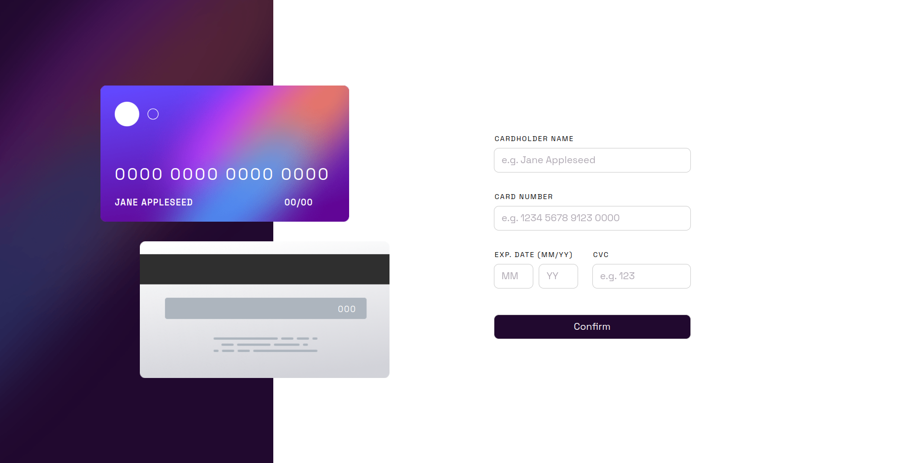

# Frontend Mentor - Interactive card details form solution

This is a solution to the [Interactive card details form challenge on Frontend Mentor](https://www.frontendmentor.io/challenges/interactive-card-details-form-XpS8cKZDWw). Frontend Mentor challenges help you improve your coding skills by building realistic projects. 

## Table of contents

- [Overview](#overview)
  - [The challenge](#the-challenge)
  - [Screenshot](#screenshot)
  - [Links](#links)
- [My process](#my-process)
  - [Built with](#built-with)
  - [What I learned](#what-i-learned)
  - [Useful resources](#useful-resources)
- [Author](#author)

## Overview

### The challenge

Users should be able to:

- Fill in the form and see the card details update in real-time
- Receive error messages when the form is submitted if:
  - Any input field is empty
  - The card number, expiry date, or CVC fields are in the wrong format
- View the optimal layout depending on their device's screen size
- See hover, active, and focus states for interactive elements on the page

### Screenshot



### Links

- Solution URL: [Add solution URL here](https://your-solution-url.com)
- Live Site URL: [Add live site URL here](https://your-live-site-url.com)

## My process

### Built with

- Semantic HTML5 markup
- CSS3
- Flexbox
- JavaScript

### What I learned

- Manipulate input with JavaScript
```js
function formatCardNo(evt) {
	// Digit only
	if (evt.which < 48 || evt.which > 57)
	{
			evt.preventDefault();
	}

	var x = document.getElementById("number");
	var index = x.value.lastIndexOf(' ');
	var test = x.value.substr(index + 1);
	if (test.length === 4 && x.value.length < 16)
			x.value = x.value + ' ';
}
```
- Build Responsive layout with Media query
```css
@media only screen and (max-width: 650px) {
```

### Useful resources

- [stackoverflow] - This helped me when I have doubt on the code, the community provide useful solutions.
- [w3schools] - This is an amazing place for me to learn html and css.
- [freecodecamp] - freecodecamp provide free course and certificate program that improve my understanding on responsive UI.

## Author

- Website - [Trystan Loke](http://www.portfolio.trystan.website/)
- Frontend Mentor - [@trystan-loke](https://www.frontendmentor.io/profile/trystan-loke)

